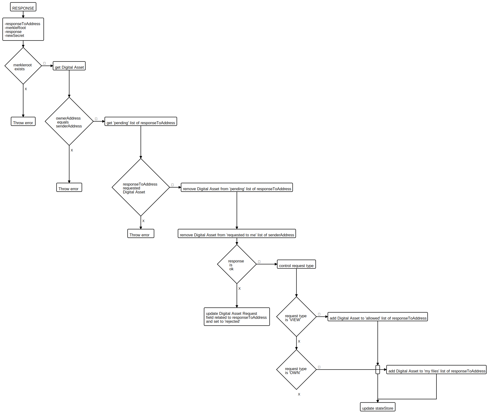

# NeatBox

Neatbox is a distributed storage system for digital assets.

The project's development is splitted in 3 sections:

1. Front End
2. Digital Asset Manager
3. Blockchain

In this document we use the following definitions.

- File -> the original document
- Digital Asset -> the file encrypted with simmetric key and splitted into chunks
- simmetric key -> AES key
- Chunk -> a portion of a file with extra control's bytes. (when referring to a chunk size is intended without the control's byte)

### 2. Digital Asset Manager

First of all, a chunk size must be defined, and a cryptographic simmetric key must be generated. The simmetric key is used to encrypt the File, then this will be splitted into _n_ chunks of the providen chunk size. If the size of the last chunk is less than the defined chunk size, this will filled with 0x00 padding bytes.

While splitting the file, 2 control's byte fields are added to the chunk:

- _length_ indicate the size of the _data_ portioin in teh chunk;
- _order_ is used to sort the chunks when the file needs to be rebuilt;

After splitting the file, his chunks will be divided into _k_(>=3) arrays of the same length (eventually padded with 0x00 chunks).

One of those arrays contain chunks obtained with a XOR operation, like the following schema:

| ARRAY 1     | ARRAY 2   | ... | ARRAY k-1    | ARRAY k                                            |
| ----------- | --------- | --- | ------------ | -------------------------------------------------- |
| chunks[0]   | chunks[1] | ... | chunks[k-2]  | chunks[0] XOR chunks[1] XOR ... XOR chunks[k-2]    |
| chunks[k-1] | chunks[k] | ... | chunks[2k-2] | chunks[k-1] XOR chunks[k] XOR ... XOR chunks[2k-2] |
| ...         | ...       | ... | ...          | ...                                                |

 

In the following table, the values in the second row indicate the length in bytes for the fields in the first one.

| xor_group       | isXOR | order                | length (<= _size_ ) | data   | padding       |
| --------------- | ----- | -------------------- | ------------------- | ------ | ------------- |
| CHUNK_XOR_BYTES | 1     | CHUNK_POSITION_BYTES | CHUNK_LENGTH_BYTES  | length | size - length |

_xor_group_ is another control's byte field used to group chunks involved in the same XOR operation (in the previous table example chunks[0], chunks[1], ..., chunks[k-2] are part of the same xor group)

### 3. Blockchain

The Blockchain used is Lisk; his role is to keep track of the history of an asset, guarantee the ownership and immutability of the information.

A user's account in the blockchain has the following properties:

- my files: list of the Digital Assets owned by the user;
- allowed: list of the Digital Assets for wich the user sent a "VIEW" Request and received an approval Response;
- pending: list of Digital Assets for wich the user sent a Request and is still waiting for a Response from the current owner;
- requested to me: list of Digital Asset owned by the user for wich the user received a Request and still did not sent a Reponse.

After splitting file into chunks, a _create_ Transaction must be called. For this transaction we need the following information:

- file name, to display in human readable way
- file size
- file hash, to check integrity
- merkle root of the merkle three built using chunks as leaf, used as a unique id to refer the Digital Asset
- merkle height
- symmetric key used to encrypt the File, encrypted with the public key of the user's wallet
- list of addresses of the node that will host the chunks, if any

These info will be stored in the stateStore of the blockchain.

A user can retrieve a list of all Digital Asset stored.

A user can send a _Request_ Transaction to ask the current owner access to the asset or even the ownership of the asset.

After receiving a _Request_, a user can send a _Response_ transaction, to approve or deny the request received. When responding to a _Request_, if the response is an "OK", the owner of the asset generate a new secret; this is the simmetric key used to encrypt the File, encrypted this time using the public key of the address who sent the _Request_.

